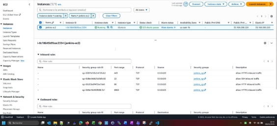
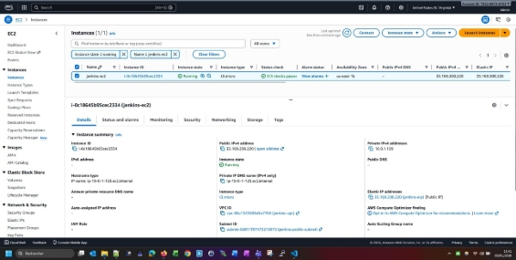
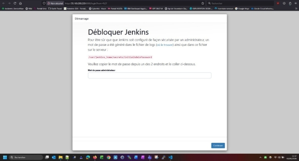

# Mini-projet-terraform-commun

## 📋 Description du projet

Ce mini-projet a pour objectif de déployer un serveur Jenkins sur AWS en utilisant Terraform comme outil d'Infrastructure as Code (IaC). Le déploiement s'appuie sur plusieurs modules Terraform pour répondre aux exigences du projet.

**Plateforme de déploiement:** Machine EC2 Ubuntu

---

## 🚀 Installation de Terraform

### Étapes d'installation sur Ubuntu

```bash
# 1. Téléchargement de Terraform
wget https://releases.hashicorp.com/terraform/1.14.2/terraform_1.14.2_linux_amd64.zip

# 2. Installation d'unzip (si nécessaire)
sudo apt install unzip

# 3. Décompression de l'archive
unzip terraform_1.14.2_linux_amd64.zip

# 4. Attribution des droits d'exécution
chmod +x terraform

# 5. Déplacement vers le répertoire binaire
sudo mv terraform /usr/local/bin/

# 6. Vérification de l'installation
terraform -version
```

**Résultat attendu:**
```
Terraform v1.14.2
```

---

## 📥 Récupération du code source

### Clonage du repository GitHub

```bash
# Vérification de Git
git -v
# git version 2.43.0

# Initialisation du dépôt local
git init

# Ajout du remote origin
git remote add origin https://github.com/narlechitane38200/mini-projet-terraform-commun.git

# Vérification des remotes
git remote -v

# Clonage du projet
git clone https://github.com/narlechitane38200/mini-projet-terraform-commun.git
```

### Structure du projet

```bash
ubuntu@ip-172-31-69-236:~$ ls -rtlh
total 30M
-rw-r--r-- 1 ubuntu ubuntu 4.9K Dec 11 11:54 LICENSE.txt
-rw-rw-r-- 1 ubuntu ubuntu  30M Dec 11 12:48 terraform_1.14.2_linux_amd64.zip
drwxrwxr-x 7 ubuntu ubuntu 4.0K Dec 20 19:53 terraform-training
drwx------ 3 ubuntu ubuntu 4.0K Dec 27 11:20 snap
drwxrwxr-x 5 ubuntu ubuntu 4.0K Jan  4 10:59 mini-projet-terraform-commun
```

---

## 🔐 Configuration de la sécurité

### Création du répertoire `.secrets`

Un répertoire `.secrets` a été créé dans le projet pour stocker de manière sécurisée :
- Le fichier `credentials` contenant les informations de connexion AWS
- La paire de clés SSH générée lors du déploiement

> ⚠️ **Important:** Ce répertoire doit être ajouté au `.gitignore` pour ne pas exposer les credentials

---

## 🏗️ Déploiement de l'infrastructure

### Initialisation du projet Terraform

```bash
# Positionnement dans le répertoire du projet
cd mini-projet-terraform-commun/app

# Initialisation de Terraform
terraform init

# Planification du déploiement (optionnel)
terraform plan

# Déploiement de l'infrastructure
terraform apply
```

### Ressources créées

Le déploiement Terraform crée les ressources AWS suivantes :

| Ressource | Description |
|-----------|-------------|
| **VPC** | Réseau virtuel privé |
| **Subnet** | Sous-réseau public |
| **Internet Gateway** | Accès Internet |
| **Route Table** | Table de routage |
| **Security Group** | Règles de pare-feu |
| **EC2 Instance** | Serveur Jenkins |
| **EBS Volume** | Volume de stockage |
| **Elastic IP** | IP publique fixe |
| **Key Pair** | Paire de clés SSH |

### Résumé du déploiement

```
Apply complete! Resources: 16 added, 0 changed, 0 destroyed.
```

**Temps de déploiement:** ~1 minute

---

## 📊 Logs de déploiement détaillés

<details>
<summary><b>🔍 Cliquez pour afficher les logs complets du déploiement Terraform</b></summary>

### Confirmation et création des ressources

```bash
Enter a value: yes

module.jenkins_keypair.tls_private_key.this: Creating...
module.jenkins_ebs.aws_ebs_volume.this: Creating...
module.jenkins_vpc.aws_vpc.my_vpc: Creating...
module.jenkins_eip.aws_eip.this: Creating...
module.jenkins_eip.aws_eip.this: Creation complete after 2s [id=eipalloc-0b0b647b173da4d22]
module.jenkins_vpc.aws_vpc.my_vpc: Creation complete after 2s [id=vpc-0dd817a32b131beb0]
module.jenkins_igw.aws_internet_gateway.my_igw: Creating...
module.jenkins_subnet.aws_subnet.subnet: Creating...
module.jenkins_rtb.aws_route_table.my_rt: Creating...
module.jenkins_sg.aws_security_group.this: Creating...
module.jenkins_igw.aws_internet_gateway.my_igw: Creation complete after 0s [id=igw-00dd9bc2877db11d2]
module.jenkins_rtb.aws_route_table.my_rt: Creation complete after 0s [id=rtb-0ae58096707cc3e97]
module.jenkins_internet_route.aws_route.my_route: Creating...
module.jenkins_subnet.aws_subnet.subnet: Creation complete after 0s [id=subnet-03ee5986e4d3aa7c6]
aws_route_table_association.my_rta: Creating...
aws_route_table_association.my_rta: Creation complete after 1s [id=rtbassoc-045a7d4c26bd55057]
module.jenkins_internet_route.aws_route.my_route: Creation complete after 1s [id=r-rtb-0ae58096707cc3e971080289494]
module.jenkins_keypair.tls_private_key.this: Creation complete after 3s [id=7c62337c3fae665d268b2587966c56f8951f4991]
module.jenkins_keypair.aws_key_pair.this: Creating...
module.jenkins_keypair.local_file.private_key: Creating...
module.jenkins_keypair.local_file.private_key: Creation complete after 0s [id=ecb3b093446667d00c2a72979627818499975fe9]
module.jenkins_keypair.aws_key_pair.this: Creation complete after 1s [id=my-ec2-key]
module.jenkins_sg.aws_security_group.this: Creation complete after 2s [id=sg-09d947490bd06fdb1]
module.jenkins_ec2.aws_instance.this: Creating...
module.jenkins_ebs.aws_ebs_volume.this: Still creating... [00m10s elapsed]
module.jenkins_ebs.aws_ebs_volume.this: Creation complete after 11s [id=vol-0e9b9fd5feaa95190]
module.jenkins_ec2.aws_instance.this: Still creating... [00m10s elapsed]
module.jenkins_ec2.aws_instance.this: Creation complete after 12s [id=i-0d1276fd485f539d9]
aws_eip_association.jenkins_eip_association: Creating...
aws_volume_attachment.jenkins_ebs_attachment: Creating...
aws_eip_association.jenkins_eip_association: Creation complete after 2s [id=eipassoc-06a5a55936b0362e7]
aws_volume_attachment.jenkins_ebs_attachment: Still creating... [00m10s elapsed]
aws_volume_attachment.jenkins_ebs_attachment: Still creating... [00m20s elapsed]
aws_volume_attachment.jenkins_ebs_attachment: Creation complete after 21s [id=vai-3521956075]
```

### Provisioning de l'instance EC2

```bash
null_resource.output_metadata: Creating...
null_resource.output_metadata: Provisioning with 'remote-exec'...
null_resource.output_metadata (remote-exec): Connecting to remote host via SSH...
null_resource.output_metadata (remote-exec):   Host: 34.194.90.154
null_resource.output_metadata (remote-exec):   User: ubuntu
null_resource.output_metadata (remote-exec):   Password: false
null_resource.output_metadata (remote-exec):   Private key: true
null_resource.output_metadata (remote-exec):   Certificate: false
null_resource.output_metadata (remote-exec):   SSH Agent: false
null_resource.output_metadata (remote-exec):   Checking Host Key: false
null_resource.output_metadata (remote-exec):   Target Platform: unix
null_resource.output_metadata (remote-exec): Connected!
```

### Mise à jour des packages système

```bash
null_resource.output_metadata (remote-exec): Hit:1 http://us-east-1.ec2.archive.ubuntu.com/ubuntu jammy InRelease
null_resource.output_metadata (remote-exec): Get:2 http://us-east-1.ec2.archive.ubuntu.com/ubuntu jammy-updates InRelease [128 kB]
null_resource.output_metadata (remote-exec): Get:3 http://us-east-1.ec2.archive.ubuntu.com/ubuntu jammy-backports InRelease [127 kB]
null_resource.output_metadata (remote-exec): Get:4 http://security.ubuntu.com/ubuntu jammy-security InRelease [129 kB]
null_resource.output_metadata (remote-exec): Get:5 http://us-east-1.ec2.archive.ubuntu.com/ubuntu jammy/universe amd64 Packages [14.1 MB]
null_resource.output_metadata (remote-exec): Get:6 http://security.ubuntu.com/ubuntu jammy-security/main amd64 Packages [2899 kB]
null_resource.output_metadata (remote-exec): Get:7 http://us-east-1.ec2.archive.ubuntu.com/ubuntu jammy/universe Translation-en [5652 kB]
null_resource.output_metadata (remote-exec): Fetched 41.7 MB in 7s (5940 kB/s)
null_resource.output_metadata (remote-exec): Reading package lists... Done
null_resource.output_metadata (remote-exec): Building dependency tree... Done
null_resource.output_metadata (remote-exec): Reading state information... Done
null_resource.output_metadata (remote-exec): All packages are up to date.
```

### Installation de Docker

```bash
null_resource.output_metadata (remote-exec): # Executing docker install script, commit: 8b33a64d28ec86a1121623f1d349801b48f2837b
null_resource.output_metadata (remote-exec): + sudo -E sh -c apt-get -qq update >/dev/null
null_resource.output_metadata: Still creating... [00m20s elapsed]
null_resource.output_metadata (remote-exec): + sudo -E sh -c DEBIAN_FRONTEND=noninteractive apt-get -y -qq install ca-certificates curl >/dev/null
null_resource.output_metadata (remote-exec): + sudo -E sh -c install -m 0755 -d /etc/apt/keyrings
null_resource.output_metadata (remote-exec): + sudo -E sh -c curl -fsSL "https://download.docker.com/linux/ubuntu/gpg" -o /etc/apt/keyrings/docker.asc
null_resource.output_metadata (remote-exec): + sudo -E sh -c chmod a+r /etc/apt/keyrings/docker.asc
null_resource.output_metadata (remote-exec): + sudo -E sh -c echo "deb [arch=amd64 signed-by=/etc/apt/keyrings/docker.asc] https://download.docker.com/linux/ubuntu jammy stable" > /etc/apt/sources.list.d/docker.list
null_resource.output_metadata (remote-exec): + sudo -E sh -c apt-get -qq update >/dev/null
null_resource.output_metadata (remote-exec): + sudo -E sh -c DEBIAN_FRONTEND=noninteractive apt-get -y -qq install docker-ce docker-ce-cli containerd.io docker-compose-plugin docker-ce-rootless-extras docker-buildx-plugin docker-model-plugin >/dev/null
null_resource.output_metadata: Still creating... [00m30s elapsed]
null_resource.output_metadata: Still creating... [00m40s elapsed]
```

### Activation du service Docker

```bash
null_resource.output_metadata (remote-exec): Using systemd to manage Docker service
null_resource.output_metadata (remote-exec): + sudo -E sh -c systemctl enable --now docker.service
null_resource.output_metadata (remote-exec): Synchronizing state of docker.service with SysV service script with /lib/systemd/systemd-sysv-install.
null_resource.output_metadata (remote-exec): Executing: /lib/systemd/systemd-sysv-install enable docker
null_resource.output_metadata (remote-exec): INFO: Docker daemon enabled and started
```

### Vérification de Docker

```bash
null_resource.output_metadata (remote-exec): + sudo -E sh -c docker version
null_resource.output_metadata (remote-exec): Client: Docker Engine - Community
null_resource.output_metadata (remote-exec):  Version:           29.1.3
null_resource.output_metadata (remote-exec):  API version:       1.52
null_resource.output_metadata (remote-exec):  Go version:        go1.25.5
null_resource.output_metadata (remote-exec):  Git commit:        f52814d
null_resource.output_metadata (remote-exec):  Built:             Fri Dec 12 14:49:37 2025
null_resource.output_metadata (remote-exec):  OS/Arch:           linux/amd64
null_resource.output_metadata (remote-exec):  Context:           default
null_resource.output_metadata (remote-exec): 
null_resource.output_metadata (remote-exec): Server: Docker Engine - Community
null_resource.output_metadata (remote-exec):  Engine:
null_resource.output_metadata (remote-exec):   Version:          29.1.3
null_resource.output_metadata (remote-exec):   API version:      1.52 (minimum version 1.44)
null_resource.output_metadata (remote-exec):   Go version:       go1.25.5
null_resource.output_metadata (remote-exec):   Git commit:       fbf3ed2
null_resource.output_metadata (remote-exec):   Built:            Fri Dec 12 14:49:37 2025
null_resource.output_metadata (remote-exec):   OS/Arch:          linux/amd64
null_resource.output_metadata (remote-exec):   Experimental:     false
null_resource.output_metadata (remote-exec):  containerd:
null_resource.output_metadata (remote-exec):   Version:          v2.2.1
null_resource.output_metadata (remote-exec):   GitCommit:        dea7da592f5d1d2b7755e3a161be07f43fad8f75
null_resource.output_metadata (remote-exec):  runc:
null_resource.output_metadata (remote-exec):   Version:          1.3.4
null_resource.output_metadata (remote-exec):   GitCommit:        v1.3.4-0-gd6d73eb8
null_resource.output_metadata (remote-exec):  docker-init:
null_resource.output_metadata (remote-exec):   Version:          0.19.0
null_resource.output_metadata (remote-exec):   GitCommit:        de40ad0
```

### Déploiement de Jenkins via Docker Compose

```bash
null_resource.output_metadata (remote-exec): services:
null_resource.output_metadata (remote-exec):   jenkins:
null_resource.output_metadata (remote-exec):     image: jenkins/jenkins:lts
null_resource.output_metadata (remote-exec):     container_name: jenkins
null_resource.output_metadata (remote-exec):     restart: unless-stopped
null_resource.output_metadata (remote-exec):     ports:
null_resource.output_metadata (remote-exec):       - '8080:8080'
null_resource.output_metadata (remote-exec):       - '50000:50000'
null_resource.output_metadata (remote-exec):     volumes:
null_resource.output_metadata (remote-exec):       - jenkins_home:/var/jenkins_home
null_resource.output_metadata (remote-exec): volumes:
null_resource.output_metadata (remote-exec):   jenkins_home:
```

### Téléchargement de l'image Jenkins

```bash
null_resource.output_metadata (remote-exec): [+] Image jenkins/jenkins:lts Pulling
null_resource.output_metadata (remote-exec): ✔ d2519f76d4c6 Pull complete 0.2s
null_resource.output_metadata (remote-exec): ✔ 13cc39f8244a Pull complete 3.6s
null_resource.output_metadata (remote-exec): ✔ 5687d4df0728 Pull complete 5.8s
null_resource.output_metadata (remote-exec): ✔ 2f1ecb09fa36 Pull complete 6.0s
null_resource.output_metadata (remote-exec): ✔ 68cdef480092 Pull complete 0.2s
null_resource.output_metadata (remote-exec): ✔ e0e73f34dee9 Pull complete 0.2s
null_resource.output_metadata (remote-exec): ✔ 687044b042c5 Pull complete 6.7s
null_resource.output_metadata (remote-exec): ✔ 501deb283b89 Pull complete 0.2s
null_resource.output_metadata (remote-exec): ✔ a9230f7c9c31 Pull complete 6.9s
null_resource.output_metadata (remote-exec): ✔ d7dd2e630238 Pull complete 8.0s
null_resource.output_metadata (remote-exec): ✔ 3fb70446889e Pull complete 0.3s
null_resource.output_metadata (remote-exec): ✔ 986be6969b0a Pull complete 0.2s
null_resource.output_metadata (remote-exec): ✔ 8d32d2b88383 Download complete 0.0s
null_resource.output_metadata (remote-exec): ✔ Image jenkins/jenkins:lts Pulled 8.6s
```

### Création des ressources Docker

```bash
null_resource.output_metadata (remote-exec): ✔ Network jenkins_default Created 0.1s
null_resource.output_metadata (remote-exec): ✔ Volume jenkins_jenkins_home Created 0.0s
null_resource.output_metadata (remote-exec): ✔ Container jenkins Created 0.3s
```

### Création du fichier de sortie

```bash
null_resource.output_metadata: Provisioning with 'local-exec'...
null_resource.output_metadata (local-exec): Executing: ["/bin/sh" "-c" "echo jenkins EC2 PUBLIC_IP: 34.194.90.154 - jenkins EC2 PUBLIC_DNS: ec2-34-194-90-154.compute-1.amazonaws.com >> jenkins_ec2.txt"]
null_resource.output_metadata: Creation complete after 56s [id=4422847760235372374]
```

### Résultat final

```bash
Apply complete! Resources: 16 added, 0 changed, 0 destroyed.
```

**⏱️ Temps total de déploiement:** ~56 secondes

</details>

---

## 📦 Installation de Docker et Jenkins

### Installation automatique de Docker

Le provisioning Terraform installe automatiquement :
- Docker Engine Community (v29.1.3)
- Docker Compose Plugin
- Containerd (v2.2.1)

### Déploiement du conteneur Jenkins

Le fichier `docker-compose.yml` déploie Jenkins avec la configuration suivante :

```yaml
services:
  jenkins:
    image: jenkins/jenkins:lts
    container_name: jenkins
    restart: unless-stopped
    ports:
      - '8080:8080'
      - '50000:50000'
    volumes:
      - jenkins_home:/var/jenkins_home

volumes:
  jenkins_home:
```

---

## 🖥️ Validation du déploiement

### Vérification sur la console AWS

#### Infrastructure déployée


#### Security Group
Règles de sécurité configurées :
- **Port 8080** : Interface web Jenkins
- **Port 50000** : Agent Jenkins
- **Port 22** : SSH



#### Volume EBS


### Test de connectivité Jenkins

**URL d'accès:** `http://34.194.90.154:8080`



✅ **Le déploiement est fonctionnel** - L'interface Jenkins est accessible via l'Elastic IP sur le port 8080.

---

## 📝 Informations de connexion

Les informations de connexion sont automatiquement enregistrées dans le fichier `jenkins_ec2.txt` :

```
jenkins EC2 PUBLIC_IP: 34.194.90.154
jenkins EC2 PUBLIC_DNS: ec2-34-194-90-154.compute-1.amazonaws.com
```

---

## 🛠️ Commandes utiles

### Gestion de l'infrastructure

```bash
# Voir l'état de l'infrastructure
terraform show

# Détruire l'infrastructure
terraform destroy

# Afficher les outputs
terraform output
```

### Gestion de Docker

```bash
# Vérifier le statut de Jenkins
docker ps

# Voir les logs de Jenkins
docker logs jenkins

# Redémarrer Jenkins
docker restart jenkins
```

---

## 📌 Notes importantes

- Le mot de passe initial de Jenkins se trouve dans le conteneur : `/var/jenkins_home/secrets/initialAdminPassword`
- L'Elastic IP garantit une adresse publique stable même après redémarrage de l'instance
- Le volume EBS assure la persistance des données Jenkins

---

## 👤 Auteur

**narlechitane38200**

📧 Contact: [GitHub](https://github.com/narlechitane38200)

---

## 📄 Licence

Voir le fichier `LICENSE.txt` pour plus de détails.
